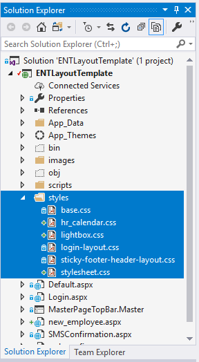

# Demo

## Create new web form with Master Page

* Select project name
* Press Ctrl + Shift + A


* Name: new\_employee
* Click on Add
* Select MasterPageTopBar.Master


* Click on OK Button

## Copy your content to content place holder

Please see the below code for inspiring

```aspnet
<%@ Page Title="" Language="C#" MasterPageFile="~/MasterPageTopBar.Master" AutoEventWireup="true" CodeBehind="new_employee.aspx.cs" Inherits="ENTLayoutTemplate.new_employee" %>

<asp:Content ID="Content1" ContentPlaceHolderID="head" runat="server">
</asp:Content>

<asp:Content ID="Content2" ContentPlaceHolderID="ContentPlaceHolderTitle" runat="server">
    New Employee General Information
</asp:Content>

<asp:Content ID="Content5" ContentPlaceHolderID="ContentPlaceHolderMain" Runat="Server">
    <table class="tblHeaderStlye">
        <tr>
            <td class="tabletitle">New Employee General Information</td>
        </tr>
        <tr>
            <td><asp:Label ID="lbError" runat="server" CssClass="redtext"></asp:Label></td>
        </tr>
    </table>
    <table class="tablestyle">
        <tr>
            <td class="tabletitle" colspan="6">Employee Information</td>
        </tr>
        <tr>
            <td>Employee Type</td>
            <td><asp:DropDownList ID="drEmployeeType" runat="server" CssClass="swiftdropdown" AutoPostBack="true"></asp:DropDownList>
            <asp:RequiredFieldValidator ID="RequiredFieldValidator6" runat="server" ControlToValidate="drEmployeeType" InitialValue="0" ErrorMessage="*"></asp:RequiredFieldValidator></td>
            <td>Employee No</td>
            <td><telerik:RadNumericTextBox ID="txtEmployeeNo" runat="server" MaxLength="10" CssClass="swifttext" Type="Number">
                <NumberFormat DecimalDigits="0" GroupSeparator="" />
                <ClientEvents OnValueChanged="checkEmployeeNo" />
                </telerik:RadNumericTextBox>
                <asp:RequiredFieldValidator ID="RequiredFieldValidator13" runat="server" ControlToValidate="txtEmployeeNo" ErrorMessage="*"></asp:RequiredFieldValidator></td>
            <td>Employee ID Card SN</td>
            <td><asp:TextBox ID="txtEmployeeSN" runat="server" CssClass="swifttext" ReadOnly="true"></asp:TextBox></td>
            <td>Employee Mobile No</td>
            <td><asp:TextBox ID="txtEmployeeMOB" runat="server" CssClass="swifttext" ReadOnly="true"></asp:TextBox></td>
        </tr>
        
        <tr>
            <td>First Name (EN)</td>
            <td><asp:TextBox runat="server" ID="txtFirstNameEn" MaxLength="30"></asp:TextBox>
            <asp:RequiredFieldValidator ID="RequiredFieldValidator1" runat="server" 
                    ControlToValidate="txtFirstNameEn" SetFocusOnError="true" 
                    ErrorMessage="*" Display="Dynamic"></asp:RequiredFieldValidator></td>
            <td>Second Name (EN)</td>
            <td><asp:TextBox runat="server" ID="txtSecondNameEn" MaxLength="30"></asp:TextBox>
            <asp:RequiredFieldValidator ID="RequiredFieldValidator2" runat="server" 
                    ControlToValidate="txtSecondNameEn" SetFocusOnError="true" 
                    ErrorMessage="*" Display="Dynamic"></asp:RequiredFieldValidator></td>
            <td>Third Name (EN)</td>
            <td><asp:TextBox runat="server" ID="txtThirdNameEn" MaxLength="30"></asp:TextBox>
            <asp:RequiredFieldValidator ID="RequiredFieldValidator3" runat="server" ControlToValidate="txtThirdNameEn" ErrorMessage="*"></asp:RequiredFieldValidator></td>
            <td>Fourth Name (EN)</td>
            <td><asp:TextBox runat="server" ID="txtFourthNameEn" MaxLength="30"></asp:TextBox>
            </td>
        </tr>
        <tr>
            <td>First Name (AR)</td>
            <td><asp:TextBox runat="server" ID="txtFirstNameAr" MaxLength="30"></asp:TextBox>
            <asp:RequiredFieldValidator ID="RequiredFieldValidator14" runat="server" ControlToValidate="txtFirstNameAr" SetFocusOnError="true" ErrorMessage="*"></asp:RequiredFieldValidator></td>
            <td>Second Name (AR)</td>
            <td><asp:TextBox runat="server" ID="txtSecondNameAr" MaxLength="30"></asp:TextBox>
            <asp:RequiredFieldValidator ID="RequiredFieldValidator15" runat="server" ControlToValidate="txtSecondNameAr" SetFocusOnError="true" ErrorMessage="*"></asp:RequiredFieldValidator></td>
            <td>Third Name (AR)</td>
            <td><asp:TextBox runat="server" ID="txtThirdNameAr" MaxLength="30"></asp:TextBox>
            <asp:RequiredFieldValidator ID="RequiredFieldValidator16" runat="server" ControlToValidate="txtThirdNameAr" SetFocusOnError="true" ErrorMessage="*"></asp:RequiredFieldValidator></td>
            <td>Fourth Name (AR)</td>
            <td><asp:TextBox runat="server" ID="txtFourthNameAr" MaxLength="30" ></asp:TextBox></td>
        </tr>
        <tr>
            <td>Mother Name</td>
            <td><asp:TextBox ID="txtMotherName" runat="server" CssClass="swifttext"></asp:TextBox></td>
            <td>Family Name(EN)</td>
            <td><asp:TextBox ID="txtFamilyName" runat="server" CssClass="swifttext"></asp:TextBox></td>
            <td>Family Name(AR)</td>
            <td><asp:TextBox ID="txtFamilyNameAr" runat="server" CssClass="swifttext"></asp:TextBox></td>
        </tr>
    </table>
    <table class="tablestyle">
        <tr>
            <td class="tabletitle" colspan="8">Employment Information</td>
        </tr>
        <tr>
            <td>Business Unit</td>
            <td><asp:DropDownList ID="drBusinessUnit" runat="server" CssClass="swiftdropdown"></asp:DropDownList>
            <asp:RequiredFieldValidator ID="RequiredFieldValidator4" runat="server" ControlToValidate="drBusinessUnit" InitialValue="0" ErrorMessage="*"></asp:RequiredFieldValidator></td>
            <td>Department</td>
            <td><asp:DropDownList ID="drDepartment" runat="server" CssClass="swiftdropdown"></asp:DropDownList></td>
        </tr>
        <tr>
            <td>Section</td>
            <td><asp:DropDownList ID="drSection" runat="server" CssClass="swiftdropdown"></asp:DropDownList></td>
            <td>Unit</td>
            <td><asp:DropDownList ID="drUnit" runat="server" CssClass="swiftdropdown"></asp:DropDownList></td>
        </tr>
        <tr>
            <td>Job</td>
            <td><asp:DropDownList ID="drJob" runat="server" CssClass="swiftdropdown"></asp:DropDownList>
            <asp:RequiredFieldValidator ID="RequiredFieldValidator11" runat="server" ControlToValidate="drJob" InitialValue="0" ErrorMessage="*"></asp:RequiredFieldValidator></td>
            <td>Grade</td>
            <td colspan="5"><asp:Label ID="lblGrade" runat="server"></asp:Label></td>

        </tr>
        <tr>
            <td>Employee Status</td>
            <td colspan="5"><%--<asp:DropDownList ID="drEmployeeStatus" runat="server" CssClass="swiftdropdown" ></asp:DropDownList>
            <asp:RequiredFieldValidator ID="RequiredFieldValidator7" runat="server" ControlToValidate="drEmployeeStatus" InitialValue="1" ErrorMessage="*"></asp:RequiredFieldValidator>--%>
            <asp:TextBox runat="server" id="txtEmpStatus" Text="Active" ReadOnly="true"/></td>
        </tr>
        <tr>
            <td>Appointment Date</td>
            <td><telerik:RadDatePicker ID="dtAppointmentDate" runat="server" Culture="English (United Kingdom)"></telerik:RadDatePicker>
                <asp:RequiredFieldValidator ID="RequiredFieldValidator12" runat="server" ErrorMessage="*" ControlToValidate="dtAppointmentDate"></asp:RequiredFieldValidator></td>
            <td>Asiacell Email Address</td>
            <td colspan="5"><asp:TextBox ID="txtEmailAddress" runat="server" CssClass="swifttext" Width="250px"></asp:TextBox></td>
        </tr>
        <tr>
            <td>Area</td>
            <td><asp:DropDownList ID="drRegion" runat="server" CssClass="swiftdropdown"></asp:DropDownList>
            <asp:RequiredFieldValidator ID="RequiredFieldValidator8" runat="server" ControlToValidate="drRegion" InitialValue="0" ErrorMessage="*"></asp:RequiredFieldValidator></td>
            <td>City</td>
            <td><asp:DropDownList ID="drCity" runat="server" CssClass="swiftdropdown"></asp:DropDownList>
            <asp:RequiredFieldValidator ID="RequiredFieldValidator9" runat="server" ControlToValidate="drCity" InitialValue="0" ErrorMessage="*"></asp:RequiredFieldValidator></td>
        </tr>
        <tr>
            <td>Location</td>
            <td><asp:DropDownList ID="drLocation" runat="server" CssClass="swiftdropdown"></asp:DropDownList>
            <asp:RequiredFieldValidator ID="RequiredFieldValidator10" runat="server" ControlToValidate="drLocation" InitialValue="0" ErrorMessage="*"></asp:RequiredFieldValidator></td>
            <td>&nbsp;</td>
            <td>&nbsp;</td>
        </tr>
    </table>    

    <table class="tablestyle">
        <tr>
            <td class="tabletitle"><asp:Button ID="btnSaveNewEmployee" runat="server" Text="Save" CssClass="swiftbutton" /></td>
        </tr>
    </table>
    <telerik:RadWindowManager id="Singleton" runat="server" Skin="WebBlue" />
</asp:Content>
```

Then build and test on localhost


As we can see the content doesn't look right. The Button doesn't have a good looking as well.

To correct them, please check your current aspx if it use additional styles-sheet. as the example, it use extra three styles-sheet, and we need to add it to the **head** placeholder.

* Copy those files


And paste it in to folder name **styles**



Then add the code to **head** placeholder

```aspnet
<asp:Content ID="Content1" ContentPlaceHolderID="head" runat="server">
    <link href="styles/stylesheet.css" rel="stylesheet" />
    <link href="styles/lightbox.css" rel="stylesheet" />
    <link href="styles/hr_calendar.css" rel="stylesheet" />
</asp:Content>
```

Build and run again, we can see the update like this:


As you can see now, the title is shown twice, and the previous look and feel need to be update.

* We need to remove the tile from the previous code.
* Select those line of codes excepted &lt;asp:label ID="lbError" .. /&gt; where we need to keep but next we will move to the bottom of the page. 


Then we need to modify the style for update look and feel to new trend of design.

* Right click on the Styles folder


Create new Style Sheet and name it as **UpdatedTableLayoutContent.css**

Drag it to the new\_employee.aspx


## Modify the look and feel

We will use Chrome Inspector to play around with the new style

Right click on the table and inspect the element


Then we can select element to see what the class name


As we can see now the class name is  .tablestyle

So that we add class name .tablestyle to the UpdatedTableLayoutContent.css

```css
.tablestyle {
    background: #f7f7f7;
    border: none;
    border-radius: 10px;
    padding: 20px;
    margin: 10px 0 10px 0;
}
```

Refresh the browser to see update below:


Repeat this step then you can modify the rest of element.

